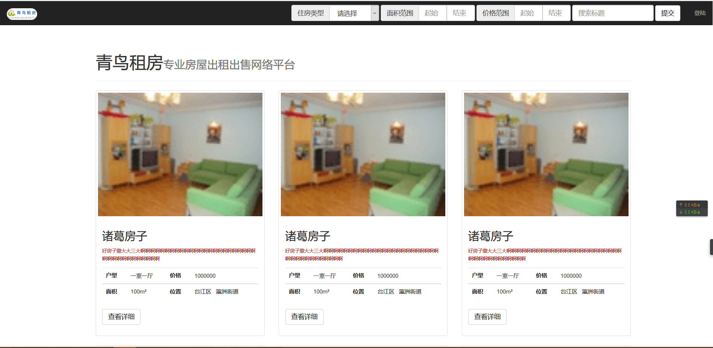
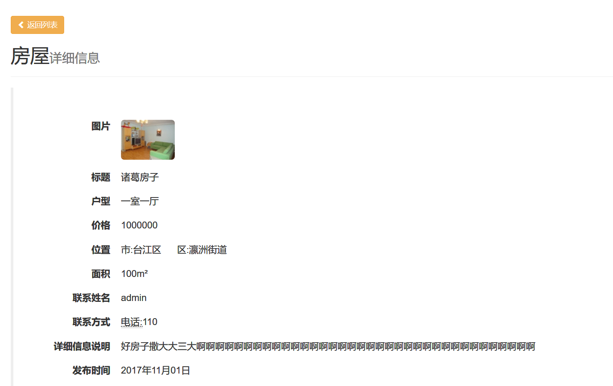
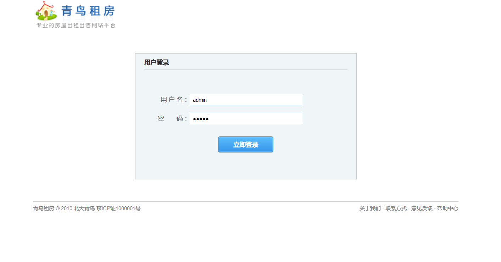
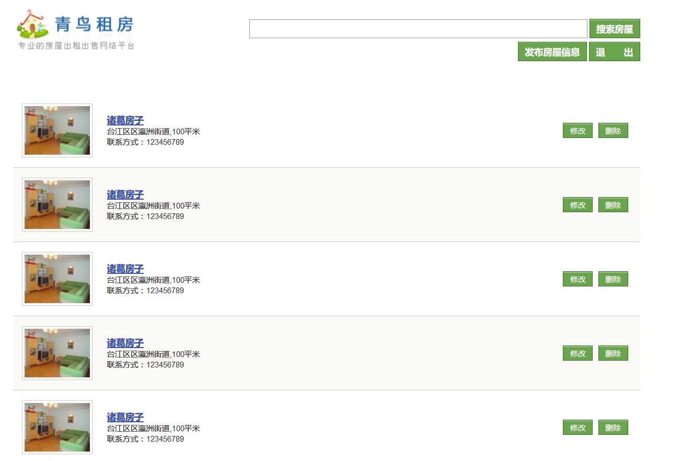
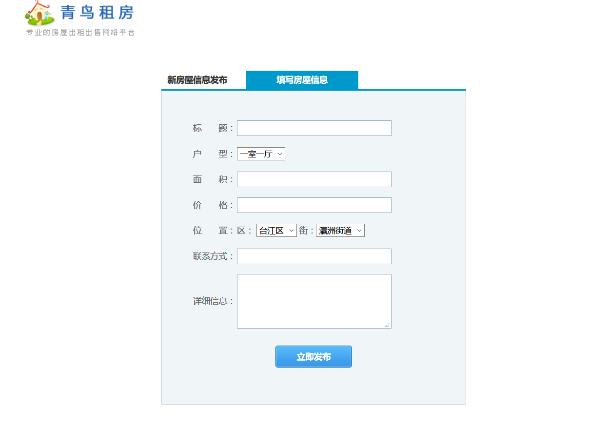

##青鸟租房web实训项目
*********
> * 框架技术:
>   * 后端:struts2+spring4+hibernate5  
>   * 前端:bootstrap
> * 测试环境:mssql2008 + tomcat + jdk8
> * 页面个数:7
> * 功能:租房信息增删改查;用户权限控制;租房信息一览
------

1. #### 配置java环境及tomcat
    > * 自行百度配置...

2. ####  配置数据库
    > * 配置sqlserver数据库账号密码 sa / 123456
    > * 执行sql文件 create.sql文件

3. #### 使用
    > * 复制[war](FAQ/housenet.war)包到{tomcat 目录}/webapps 下
    > * 启动tomcat 
    > * 浏览器打开 [http://localhost:8080/housenet/](http://localhost:8080/housenet)
    
4. #### 高级修改
    > * 数据库连接修改 /src/resources/db.properties  
 ``` 
      #datasrous 数据链接配置
      jdbcUrl=jdbc:sqlserver://localhost:1433;databaseName=housenet
      driverClass=com.microsoft.sqlserver.jdbc.SQLServerDriver
      user=sa
      password=123456
      initialPoolSize=10
      maxPoolSize=30
      
      #hibernate 配置
      hibernate.dialect = org.hibernate.dialect.SQLServer2008Dialect
      hibernate.show_sql = true
      hibernate.hbm2ddl.auto = update
 ``` 
```$xslt
src 目录树
├─main
│  ├─java
│  │  └─xyz
│  │      └─lihang
│  │          └─housenet
│  │              │  Constant.java
│  │              │  
│  │              ├─action
│  │              │      BaseAction.java
│  │              │      ErrorAction.java
│  │              │      IndexAction.java
│  │              │      ManagerAction.java
│  │              │      PointAction.java
│  │              │      
│  │              ├─aop
│  │              │      JSONAop.java
│  │              │      JSONInvok.java
│  │              │      
│  │              ├─dao
│  │              │      BaseDao.java
│  │              │      DistrictDao.java
│  │              │      HouseDao.java
│  │              │      StreetDao.java
│  │              │      TypeDao.java
│  │              │      UsersDao.java
│  │              │      
│  │              ├─entity
│  │              │      DistrictEntity.java
│  │              │      HouseEntity.java
│  │              │      StreetEntity.java
│  │              │      TypeEntity.java
│  │              │      UsersEntity.java
│  │              │      
│  │              ├─filter
│  │              │      LoginFilter.java
│  │              │      
│  │              ├─service
│  │              │  │  AbsBaseService.java
│  │              │  │  BaseService.java
│  │              │  │  IDistrictService.java
│  │              │  │  IHouseService.java
│  │              │  │  IStreetService.java
│  │              │  │  ITypeService.java
│  │              │  │  IUserService.java
│  │              │  │  
│  │              │  └─impl
│  │              │          DistrictService.java
│  │              │          HouseService.java
│  │              │          StreetService.java
│  │              │          TypeService.java
│  │              │          UserService.java
│  │              │          
│  │              └─utils
│  │                      GeneralQueryHelper.java
│  │                      JsonWriterUtil.java
│  │                      MyException.java
│  │                      Page.java
│  │                      PageUtils.java
│  │                      Range.java
│  │                      RenderJson.java
│  │                      SetContentType.java
│  │                      SimplePropertyFilter.java
│  │                      
│  ├─resources
│  │  │  bean.xml
│  │  │  db.properties
│  │  │  log4j2.xml
│  │  │  struts.xml
│  │  │  
│  │  └─sqlfile
│  │          create.sql
│  │          
│  └─webapp
│      │  error.jsp
│      │  favicon.ico
│      │  index.jsp
│      │  
│      ├─common
│      │      base.jsp
│      │      
│      ├─css
│      │      errorStyle.css
│      │      style.css
│      │      
│      ├─images
│      │      btn_bg.gif
│      │      error.png
│      │      logo.gif
│      │      selector_arrow.gif
│      │      thumb_house.gif
│      │      
│      ├─META-INF
│      │      MANIFEST.MF
│      │      
│      ├─ref
│      │  └─bootstrap
│      │      ├─css
│      │      │      bootstrap-theme.css
│      │      │      bootstrap-theme.css.map
│      │      │      bootstrap-theme.min.css
│      │      │      bootstrap-theme.min.css.map
│      │      │      bootstrap.css
│      │      │      bootstrap.css.map
│      │      │      bootstrap.min.css
│      │      │      bootstrap.min.css.map
│      │      │      
│      │      ├─fonts
│      │      │      glyphicons-halflings-regular.eot
│      │      │      glyphicons-halflings-regular.svg
│      │      │      glyphicons-halflings-regular.ttf
│      │      │      glyphicons-halflings-regular.woff
│      │      │      glyphicons-halflings-regular.woff2
│      │      │      
│      │      └─js
│      │              bootstrap.js
│      │              bootstrap.min.js
│      │              npm.js
│      │              
│      ├─scripts
│      │      function.js
│      │      jquery-1.12.4.js
│      │      jquery-2.1.3.min.js
│      │      
│      └─WEB-INF
│          │  web.xml
│          │  
│          ├─jsp
│          │  ├─error
│          │  │      404.jsp
│          │  │      
│          │  ├─house
│          │  │      add.jsp
│          │  │      manager.jsp
│          │  │      update.jsp
│          │  │      
│          │  └─page
│          │          index.jsp
│          │          login.jsp
│          │          show.jsp
│          │          
│          └─lib
│                  sqljdbc4.jar
│                  
└─test
    └─java
        └─xyz
            └─lihang
                    jdbc.java
```    
     
5. #### 打包 (自行安装maven)
    > * mvn clean package

6. ####示例图片
    * 
    
    * 
    
    * 
    
    * 
    
    * 
    
    


